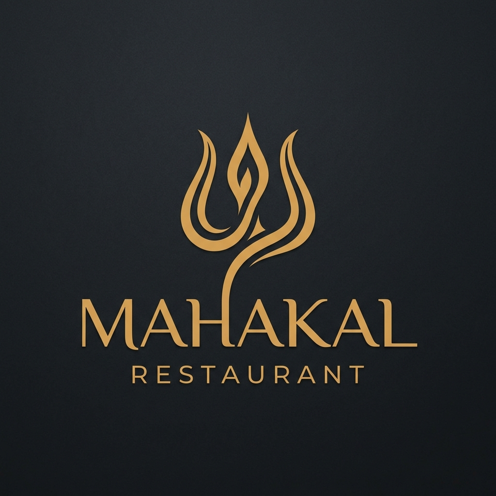

<p align="center">
  
</p>

<h1 align="center">🍽️ Super Restaurant</h1>

<p align="center">
  <strong>A high-converting, SEO-optimized landing page for an authentic Indian restaurant</strong>
</p>

<p align="center">
  <a href="#-features"></a>
  <a href="#-features"></a>
  <a href="#-features"></a>
  <a href="#-features"></a>
</p>

<p align="center">
  <a href="#-quick-start">Quick Start</a> •
  <a href="#-features">Features</a> •
  <a href="#-tech-stack">Tech Stack</a> •
  <a href="#-project-structure">Structure</a> •
  <a href="#-deployment">Deploy</a>
</p>

---

## ✨ Features

| Feature | Description |
|---------|-------------|
| 🎯 **Google Ads Optimized** | Landing page follows Google Ads quality guidelines — clear CTAs, fast load, mobile-friendly, no intrusive popups |
| 🔍 **Full SEO Suite** | Meta tags, Open Graph, Twitter Cards, JSON-LD structured data (Restaurant schema), dynamic sitemap, robots.txt |
| 💬 **WhatsApp Integration** | Every CTA button triggers WhatsApp with pre-filled message. Floating WhatsApp FAB with pulse animation |
| 🌙 **Dark Minimalistic UI** | Premium dark brown theme with gold accents, smooth scroll animations, and elegant typography |
| 📱 **Fully Responsive** | Mobile-first design tested at 375px, 768px, 1024px, and 1440px breakpoints |
| ⚡ **Blazing Fast** | Zero external dependencies, CSS-only animations, optimized images via `next/image`, self-hosted fonts |
| 🔒 **Privacy Policy** | Google Ads compliant privacy policy page included |

---

## 🚀 Quick Start

```bash
# Clone the repository
git clone https://github.com/amit2003-cse/Restaurant-landing-page.git

# Navigate to project
cd Restaurant-landing-page

# Install dependencies
npm install

# Start development server
npm run dev
```

Open [http://localhost:3000](http://localhost:3000) to view the landing page.

---

## 🛠️ Tech Stack

<table>
  <tr>
    <td align="center"><strong>Framework</strong></td>
    <td>Next.js 16 (App Router)</td>
  </tr>
  <tr>
    <td align="center"><strong>Language</strong></td>
    <td>JavaScript (ES6+)</td>
  </tr>
  <tr>
    <td align="center"><strong>Styling</strong></td>
    <td>Vanilla CSS with CSS Custom Properties</td>
  </tr>
  <tr>
    <td align="center"><strong>Fonts</strong></td>
    <td>Inter + Playfair Display (via next/font)</td>
  </tr>
  <tr>
    <td align="center"><strong>Animations</strong></td>
    <td>CSS Keyframes + IntersectionObserver</td>
  </tr>
  <tr>
    <td align="center"><strong>Deployment</strong></td>
    <td>Vercel</td>
  </tr>
</table>

---

## 📁 Project Structure

```
ads/
├── app/
│   ├── layout.js              # Root layout — SEO meta, fonts, JSON-LD
│   ├── page.js                # Main landing page (all sections)
│   ├── globals.css            # Design system & all styles
│   ├── sitemap.js             # Dynamic XML sitemap
│   └── privacy-policy/
│       └── page.js            # Privacy policy (Google Ads compliant)
├── components/
│   ├── Hero.js                # Hero banner with dual CTAs
│   ├── About.js               # About restaurant section
│   ├── WhyChoose.js           # Feature cards grid (4 cards)
│   ├── PopularDishes.js       # Popular menu items
│   ├── Reviews.js             # Customer reviews with star ratings
│   ├── DiscountCTA.js         # 15% discount call-to-action
│   ├── OpeningHours.js        # Business hours display
│   ├── Contact.js             # Contact via WhatsApp
│   ├── Footer.js              # Footer with privacy policy link
│   ├── WhatsAppButton.js      # Floating WhatsApp FAB (bottom-right)
│   └── WhatsAppLink.js        # Reusable WhatsApp CTA component
└── public/
    ├── images/logo.png        # Restaurant logo
    └── robots.txt             # Search engine crawl rules
```

---

## 🎨 Design System

### Color Palette

| Swatch | Token | Hex | Usage |
|--------|-------|-----|-------|
| 🟤 | `--bg-primary` | `#1a0f0a` | Page background |
| 🟫 | `--bg-section-alt` | `#231510` | Alternate sections |
| 🟫 | `--bg-card` | `#2a1a12` | Feature cards |
| 🟡 | `--accent-gold` | `#d4a96a` | Headings, CTAs, accents |
| 🟢 | `--accent-green` | `#25D366` | WhatsApp buttons |
| ⬜ | `--text-primary` | `#ffffff` | Headings |
| 🔘 | `--text-secondary` | `#c4b5a5` | Body text |

### Typography

- **Headings:** Playfair Display (700, 900) — elegant serif
- **Body:** Inter (400, 600) — clean sans-serif

---

## 📦 Deployment

### Deploy to Vercel (Recommended)

[](https://vercel.com/new/clone?repository-url=https://github.com/amit2003-cse/Restaurant-landing-page)

Or deploy manually:

```bash
# Install Vercel CLI
npm i -g vercel

# Deploy
vercel --prod
```

### Post-Deployment Checklist

- [ ] Update `sitemap.js` base URL with your actual domain
- [ ] Update `robots.txt` sitemap URL
- [ ] Update Open Graph image URL in `layout.js`
- [ ] Test all WhatsApp links on mobile & desktop
- [ ] Run [Google PageSpeed Insights](https://pagespeed.web.google.com/)
- [ ] Submit sitemap to [Google Search Console](https://search.google.com/search-console)

---

## 📊 SEO Checklist

- [x] Semantic HTML5 (`<main>`, `<section>`, `<footer>`)
- [x] Single `<h1>` per page with proper heading hierarchy
- [x] Meta title & description optimized for target keywords
- [x] Open Graph & Twitter Card meta tags
- [x] JSON-LD structured data (Restaurant schema)
- [x] Dynamic XML sitemap (`/sitemap.xml`)
- [x] `robots.txt` with crawl directives
- [x] Self-hosted fonts (zero CLS)
- [x] Responsive images via `next/image`
- [x] Mobile-friendly responsive design
- [x] Privacy policy page
- [x] Accessible (`aria-label`, semantic elements)

---

## 🤝 Google Ads Compliance

This landing page is built following [Google Ads landing page experience guidelines](https://support.google.com/google-ads/answer/6227382):

| Requirement | Status |
|-------------|--------|
| Clear business identity | ✅ |
| Relevant content matching ad keywords | ✅ |
| Above-the-fold CTA | ✅ |
| Mobile-friendly | ✅ |
| Fast page load | ✅ |
| Easy navigation | ✅ |
| No misleading content | ✅ |
| No intrusive popups | ✅ |
| Privacy policy | ✅ |
| Trust signals (reviews, hours, contact) | ✅ |

---

## 📄 License

This project is open source and available under the [MIT License](LICENSE).

---

<p align="center">
  Built with ❤️ for <strong>Super Restaurant</strong>
</p>
